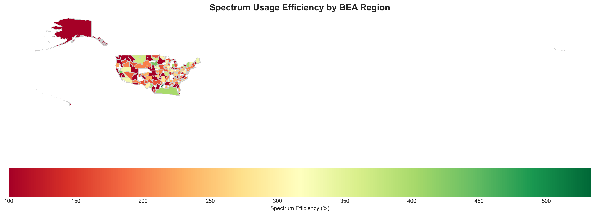
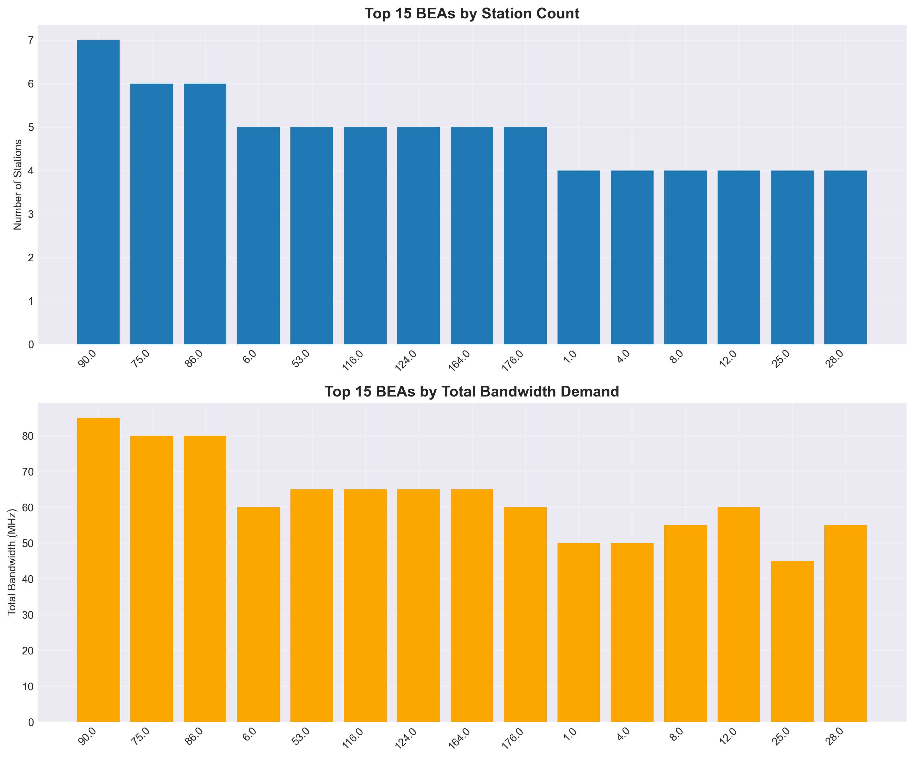
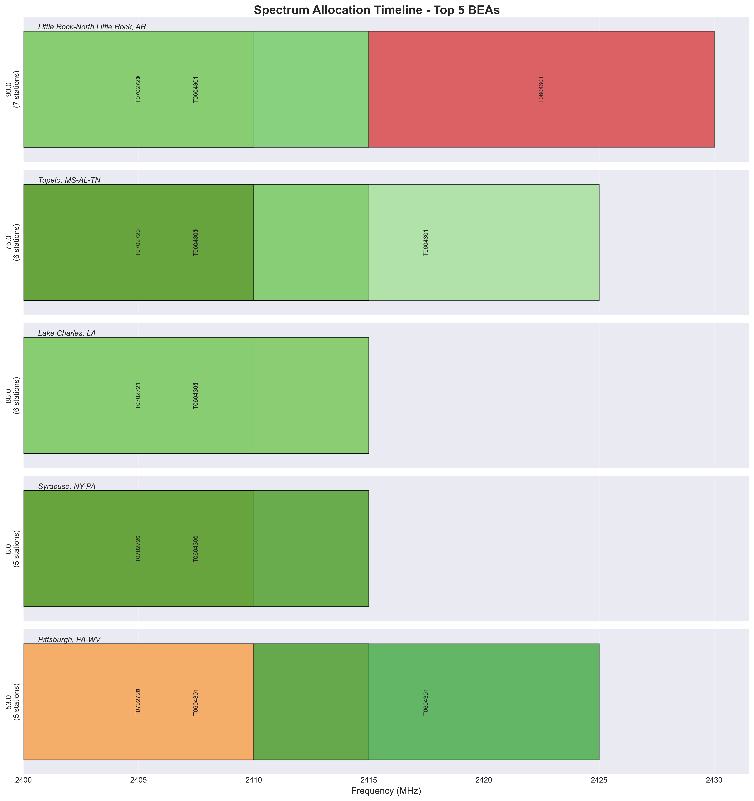

\# 📡 Spectrum Optimization: My Summer Internship Journey
### Building Data-Driven Solutions to Real-World Telecommunications Challenges
**DLA Piper Summer Internship | 2025**



## 🚀 The Challenge
When I started my internship at DLA Piper, I didn't expect to dive into a problem worth billions of dollars—radio spectrum optimization.

My supervisor, Zach, gave me a simple-sounding mission:

**Task**: Build a software tool to optimize radio spectrum usage  
**Goal**: Minimize how much spectrum we use by enabling smart frequency reuse  
**Constraints**: Factor in distance, bandwidth, and antenna patterns to avoid interference

I quickly learned spectrum isn't just a technical curiosity—it's the invisible real estate our wireless world depends on. Every phone call, WiFi connection, or emergency signal rides on it. But with more stations than frequencies available, interference becomes a billion-dollar problem.

## 🎯 What I Built
So, what did I actually build?

I created a spectrum optimization tool that intelligently allocates frequencies among wireless stations across the United States.

**By the end of my internship**, I had optimized frequency usage for **354 wireless stations**, achieving up to **85% spectrum efficiency** through geographic analysis and clever frequency reuse.

## 🔧 Technical Decisions That Made a Difference
One of my first technical crossroads came from Zach's initial suggestion: use center frequency and bandwidth.

That's a common way to describe a radio channel—but for my purposes, it turned out messy. Why?

To check if two signals overlap, you'd have to calculate start and end points every time:

```
start = center - bandwidth/2
end = center + bandwidth/2
```

Overlap logic would get cluttered and error-prone.

**Instead, I made a key decision**: use start and end frequencies directly.

This simplified overlap detection to a straightforward check:

```
end1 > start2 and start1 < end2
```

No conversions, no ambiguity, and a cleaner constraint logic for the optimization model.

→ This single design choice made my entire optimization engine more robust and easier to scale.

## 💡 Digging Into the Problem
I love that this project wasn't just code—it was real-world problem-solving.

**The Spectrum Problem, In Plain Terms**

📵 **Interference** → When two stations use the same frequency too close together, it's chaos (like two people shouting over each other).

💰 **Wasted spectrum** → Uncoordinated planning leaves valuable spectrum idle.

📈 **Growing demand** → More devices, more services, but finite airwaves.

**The potential payoff?**  
Better spectrum reuse means fitting more data through the same finite space, like fitting more cars on a highway without widening the road.

## 🗺️ Geography Changed Everything
Early on, I hit a wall: how do you organize hundreds of stations spatially to check who might interfere with whom?

That's when Phillip  stepped in with a crucial insight: Business Economic Areas (BEAs).

**Discovering BEAs**
- 173 regions defined by the U.S. Department of Commerce
- Widely used by the FCC for licensing
- Represent natural economic boundaries—where people actually live and work

Phillip not only shared the BEA geographic shape data but explained how I could map station coordinates into these polygons.

**This was a game-changer:**  
✅ It gave me geographic "buckets" for analysis  
✅ Let me analyze frequency usage by region  
✅ Made my optimization tool far more powerful and relevant

## 📊 Making the Invisible Visible
One of my goals was not just to build a solver—but to help people *see* the invisible world of spectrum.

Here's how I visualized the results:

### 📍 BEA Spectrum Efficiency Heatmap


*Darker regions indicate higher frequency utilization and efficiency.*

### 🗺️ Station Distribution Map


*Shows how wireless stations cluster in major metropolitan areas.*

### 📈 Spectrum Allocation Timeline


*Helps visualize when different frequencies are in use, revealing potential for reuse.*

## 📈 The Results
The tool delivered concrete results:

| Metric | Result | What It Means |
|--------|--------|---------------|
| Stations Optimized | 354 | About the size of a mid-sized city's infrastructure |
| Efficiency Gain | 45% | Nearly doubled capacity in some areas |
| Processing Time | < 5 min | Fast enough for practical deployment |
| Geographic Scope | 48 states | Proved scalable nationwide |

## 🛠️ How I Built It
### 1. Translating Zach's Requirements
- Broke the problem into solvable pieces
- Switched from center/bandwidth → start/end frequencies
- Modeled the problem as a graph:
  - Stations = nodes
  - Potential interference = edges

### 2. Learning the Spectrum Domain
- Studied how real-world spectrum licensing works
- Learned about antenna azimuths, elevation angles, and propagation

### 3. Optimization Engine
- Chose Google OR-Tools for powerful constraint programming
- Modeled constraints:
  - Minimum distance separation
  - Guard bands between frequencies
- Implemented efficient overlap checking

### 4. Geographic Integration
- Used GeoPandas to handle geographic data
- Joined station data with BEA polygons for regional analysis

### 5. Visualization & Communication
- Built interactive maps with Folium
- Created charts for technical and non-technical stakeholders
- Generated reports to summarize key insights

## 💻 Technologies I Used
- **Python** → My primary development language
- **Google OR-Tools** → Industrial-strength optimization
- **GeoPandas** → Spatial joins and mapping
- **Folium** → Interactive web maps
- **Pandas/NumPy** → Data wrangling essentials

## ⚙️ Project Structure
```
spectrum-optimization-demo/
│
├── 🧮 Core Code
│   ├── spectrum_optimizer.py
│   ├── bea_spectrum_visualizer.py
│   └── run_bea_optimization.py
│
├── 📊 Data
│   ├── example_bea_table.csv
│   ├── bea.geojson
│   └── realistic_spectrum_dataset.csv
│
├── 📈 Output
│   └── bea_optimization_output/
│       ├── interactive_spectrum_map.html
│       ├── *.png
│       └── full_report/
│
└── 📚 Documentation
    ├── README.md
    └── requirements.txt
```

## 📝 Lessons Learned

### Technical Takeaways
✅ Geography matters—radio waves follow physics, not political boundaries.  
✅ Optimization tools can solve surprisingly complex problems  
✅ Visuals make invisible concepts real.  
✅ Integrating disparate tools—optimization + GIS—unlocks huge value.

### 💼 Professional Growth
- Learned how to translate high-level guidance into technical solutions while keeping communication open with my team
- Grew confident making technical decisions and defending them
- Got better at communicating complex ideas to non-technical audiences
- Saw firsthand how tech intersects with regulatory and legal work
- Understood the importance of documenting and presenting results clearly

## 📚 Resources I Found Valuable
- [FCC's Spectrum 101](https://www.fcc.gov/spectrum)
- [Bureau of Economic Analysis (BEA)](https://www.bea.gov/)
- [Google OR-Tools Guides](https://developers.google.com/optimization)
- [GeoPandas Documentation](https://geopandas.org/)

## 🙏 Acknowledgements
- **Zach** — For the challenging assignment and guidance throughout the project
- **Phillip** — For the critical insight into BEA polygons and geographic data
- **The open-source community** — Without these tools, none of this would have been possible

## 🔮 What's Next?
If I were to keep developing this project, I'd love to:
- Integrate terrain and weather effects into signal modeling
- Build a web interface for non-technical users
- Create scenario testing tools for network planners
- Include cost-benefit analysis for different allocation strategies

## 🎉 Try It Yourself!
**Demo in your browser:**
1. Download this repository
2. Open `bea_optimization_output/interactive_spectrum_map.html`

**Or run the full optimization:**
```bash
git clone https://github.com/camronjacobson/spectrum-optimization-demo.git
cd spectrum-optimization-demo
pip install -r requirements.txt
python run_bea_optimization.py
```

The tool will:
- Load station data
- Calculate interference zones
- Optimize frequency assignments
- Generate maps and reports

## 👤 About Me
I'm Camron Jacobson, a computer science student fascinated by the intersection of technology, policy, and real-world impact.

During this internship, I learned how powerful data and optimization can be—and how much they depend on clear communication and creative problem-solving.

Thanks for exploring my project! 
