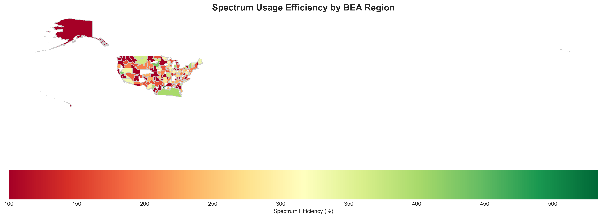

# 📡 Spectrum Optimization with BEA Geographic Integration

Advanced spectrum optimization tool that minimizes frequency usage while preventing interference, now with Business Economic Area (BEA) geographic visualization capabilities.



## 🌟 Features

- **Constraint-based Optimization**: Uses geographic distance and antenna patterns to prevent interference
- **Global Spectrum Reuse**: Maximizes frequency reuse across multiple license areas
- **BEA Integration**: Maps wireless stations to BEA regions for geographic analysis
- **Interactive Visualizations**: HTML maps and comprehensive charts
- **Scalable Architecture**: Handles nationwide datasets with intelligent partitioning

## 🚀 Quick Start

### Prerequisites

```bash
python >= 3.8
```

### Installation

1. Clone the repository:
```bash
git clone https://github.com/camronjacobson/spectrum-optimization-demo.git
cd spectrum-optimization-demo
```

2. Install dependencies:
```bash
pip install pandas numpy matplotlib seaborn geopandas folium networkx ortools scipy scikit-learn
```

### Running the BEA Optimization

```bash
python run_bea_optimization.py
```

This will:
- Load 354 AWS (Advanced Wireless Service) stations from `example_bea_table.csv`
- Map stations to BEA regions using `bea.geojson`
- Run spectrum optimization to minimize interference
- Generate interactive maps and visualizations in `bea_optimization_output/`

## 📊 Example Outputs

### Interactive Map
Open `bea_optimization_output/interactive_spectrum_map.html` in your browser to see:
- Station locations with optimized frequencies
- BEA region boundaries
- Spectrum efficiency heatmap

### Visualizations Generated

| File | Description |
|------|-------------|
| `spectrum_visualization.png` | Frequency allocation timeline |
| `bea_spectrum_efficiency.png` | Efficiency by BEA region |
| `aws_allocation_methods.png` | Optimization method distribution |
| `bea_station_distribution.png` | Stations per BEA region |

## 🗂️ Project Structure

```
spectrum-optimization-demo/
├── README.md                              # This file
├── requirements.txt                       # Python dependencies
│
├── Core Optimization Engine
│   ├── spectrum_optimizer.py              # Main optimization engine
│   ├── Spectrum_Optimizer_Result_Analyzer.py  # Results analysis tools
│   └── bea_mapper.py                      # BEA geographic mapping
│
├── BEA Integration
│   ├── bea_spectrum_visualizer.py         # BEA visualization system
│   ├── bea_csv_reader.py                  # BEA data processing
│   └── run_bea_optimization.py            # Main runner script
│
├── Data Files
│   ├── example_bea_table.csv              # 354 AWS wireless stations
│   ├── bea.geojson                        # BEA region boundaries
│   └── realistic_spectrum_dataset.csv     # Test dataset
│
└── Output (generated)
    └── bea_optimization_output/           # All results go here
```

## 🔧 Core Components

### 1. Spectrum Optimizer (`spectrum_optimizer.py`)
- Implements constraint programming using Google OR-Tools
- Supports multiple optimization strategies:
  - Local optimization within clusters
  - Global optimization across regions
  - Hierarchical optimization for large datasets

### 2. BEA Integration (`bea_spectrum_visualizer.py`)
- Maps stations to Business Economic Areas
- Creates interactive Folium maps
- Generates efficiency metrics by region

### 3. Result Analyzer (`Spectrum_Optimizer_Result_Analyzer.py`)
- Calculates spectrum efficiency metrics
- Identifies optimization issues
- Generates comprehensive reports

## 📈 Algorithm Details

The optimizer uses a multi-level approach:

1. **Conflict Detection**: Build interference graph based on:
   - Distance thresholds (5km urban, 30km suburban, 50km rural)
   - Antenna azimuth patterns (90° threshold)
   - Elevation angles (30° threshold)

2. **Partitioning**: Separate into independent conflict zones using graph components

3. **Optimization**: Apply appropriate strategy:
   - Small components: Exact CP-SAT solver
   - Large components: Hierarchical decomposition
   - Failed cases: Greedy heuristic fallback

4. **Spectrum Reuse**: Enable frequency sharing across non-interfering regions

## 🎯 Use Cases

- Wireless network planning
- Spectrum policy analysis
- Interference mitigation studies
- Geographic spectrum usage visualization

## 📝 Configuration

Key parameters in `spectrum_optimizer.py`:

```python
CHANNEL_STEP = 5  # MHz
GLOBAL_LOW_FREQ = 2400  # MHz
GLOBAL_HIGH_FREQ = 2500  # MHz
AREA_DISTANCE_THRESHOLDS = {
    "urban": 5,      # km
    "suburban": 30,  # km
    "rural": 50      # km
}
```

## 🤝 Contributing

Contributions welcome! Please:
1. Fork the repository
2. Create a feature branch
3. Submit a pull request

## 📜 License

[Add your license here]

## 👥 Authors

[Your name/team]

## 🙏 Acknowledgments

- FCC for BEA geographic data
- Google OR-Tools for optimization engine
- [Any other acknowledgments]
