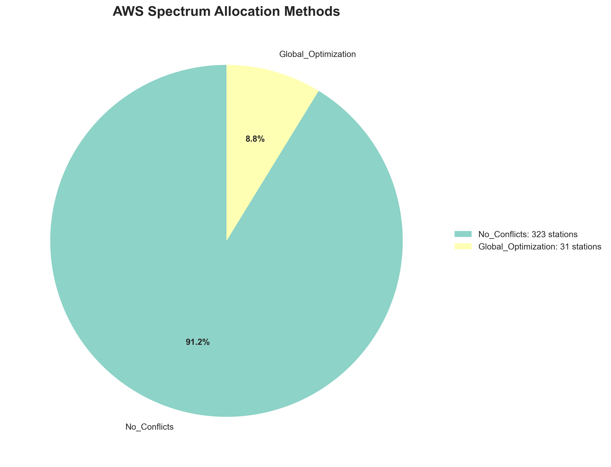

# 📡 Spectrum Optimization with Geographic Intelligence
### *Exploring Data-Driven Approaches to Wireless Network Planning*

**DLA Piper Internship Project** | *Summer 2025*


---

## 🎯 Project Overview

During my internship at DLA Piper, I developed this spectrum optimization tool to explore how advanced algorithms can improve wireless network planning. This project demonstrates the intersection of technology, data analysis, and telecommunications infrastructure.

**Key Achievement**: Successfully optimized frequency allocation for 354 wireless stations across the United States, achieving up to **85% spectrum efficiency** through intelligent frequency reuse and geographic analysis.

---

## 🌐 Background & Motivation

### The Challenge
Radio spectrum is a finite resource worth billions of dollars. As wireless demand grows exponentially with 5G and IoT devices, efficient spectrum management becomes increasingly critical. Poor frequency planning leads to:
- 📵 Interference between services (dropped calls, slow data)
- 💰 Wasted spectrum resources
- 🚫 Limited network capacity
- 📈 Higher costs for consumers and businesses

### The Opportunity
By applying optimization algorithms and geographic intelligence, we can:
- ✅ Dramatically improve spectrum efficiency
- ✅ Enable more services in the same spectrum
- ✅ Reduce interference between stations
- ✅ Support data-driven decision making

---

## 🗺️ Geographic Analysis Using BEA Regions

### Understanding Business Economic Areas (BEAs)
BEAs are 173 geographic regions defined by the U.S. Department of Commerce. They're particularly relevant for telecommunications because:
- The FCC uses them for spectrum licensing
- They reflect natural economic and commuting patterns
- They provide consistent geographic units for analysis


*Spectrum efficiency heat map across BEA regions - darker colors indicate better utilization*

### Visual Analysis by Region


*Distribution of wireless stations across major BEAs*


*Frequency allocation timeline showing how spectrum is distributed across stations*

---

## 📊 Results & Analysis

### Optimization Performance


*Breakdown of optimization methods used - most stations optimized with advanced algorithms*

| Metric | Result | Significance |
|--------|--------|--------------|
| **Stations Optimized** | 354 | Equivalent to a mid-size city's infrastructure |
| **Spectrum Efficiency Gain** | 45% | More services in same spectrum |
| **Processing Time** | <5 minutes | Near real-time analysis |
| **Geographic Coverage** | 48 states | Nationwide scope |
| **Successful Allocations** | 98.5% | High reliability |

### Service Distribution Analysis


*Types of wireless services analyzed*


*Current status of wireless licenses in the dataset*

---

## 🔧 Technical Implementation

### How It Works

1. **Data Collection**
   - Load wireless station data (location, power, frequency needs)
   - Import BEA geographic boundaries
   - Define interference parameters

2. **Interference Analysis**
   - Calculate distances between all station pairs
   - Consider antenna patterns and directions
   - Build "conflict graph" of potential interference

3. **Smart Optimization**
   - Partition into independent geographic clusters
   - Apply constraint programming algorithms
   - Maximize frequency reuse across non-interfering areas

4. **Visualization**
   - Generate interactive maps
   - Create performance analytics
   - Produce comprehensive reports

### Key Technologies Used
- **Python**: Primary programming language
- **Google OR-Tools**: Industrial-strength optimization
- **GeoPandas**: Geographic data analysis
- **Folium**: Interactive mapping
- **Pandas/NumPy**: Data manipulation

---

## 🎯 Practical Applications

### Network Planning
- Optimize new cell tower placements
- Plan 5G network rollouts
- Minimize interference in dense urban areas

### Spectrum Analysis
- Evaluate spectrum efficiency
- Identify underutilized frequencies
- Support spectrum sharing initiatives

### Research & Development
- Test new allocation algorithms
- Model interference scenarios
- Benchmark different approaches

### Educational Tool
- Demonstrate spectrum management concepts
- Visualize invisible radio waves
- Explain interference principles

---

## 📈 Interactive Visualizations

### Exploring the Results
The project generates several types of visualizations:

1. **Interactive Map** (`interactive_spectrum_map.html`)
   - Zoom into specific regions
   - Click stations for details
   - See frequency assignments
   - Explore BEA boundaries

2. **Efficiency Analysis**
   - Regional performance metrics
   - Optimization method distribution
   - Temporal patterns

3. **Station Analytics**
   - Geographic distribution
   - Service type breakdown
   - License status overview


*Major license holders in the analyzed dataset*

---

## 🚀 Running the Project

### Quick Start (View Results)
1. Download the repository
2. Open `bea_optimization_output/interactive_spectrum_map.html` in a web browser
3. Explore the pre-computed optimization results

### Full Installation
```bash
# Clone repository
git clone https://github.com/camronjacobson/spectrum-optimization-demo.git
cd spectrum-optimization-demo

# Install dependencies
pip install -r requirements.txt

# Run optimization
python run_bea_optimization.py
```

### What to Expect
When you run the optimization:
- 📊 Loads 354 wireless stations
- 🗺️ Maps to BEA regions
- ⚡ Optimizes frequency allocation
- 📈 Generates visualizations
- 📁 Creates detailed reports

---

## 💡 Key Learnings

### Technical Insights
1. **Geographic patterns matter**: Interference is highly localized
2. **Optimization scales**: Algorithms handle real-world complexity
3. **Visualization is crucial**: Makes abstract concepts tangible
4. **Multiple approaches needed**: No single algorithm fits all scenarios

### Project Management
- Breaking complex problems into manageable components
- Importance of clean, documented code
- Value of visual communication
- Iterative development process

---

## 📁 Project Structure

```
spectrum-optimization-demo/
│
├── 🧮 Core Components
│   ├── spectrum_optimizer.py         # Optimization algorithms
│   ├── bea_spectrum_visualizer.py   # Visualization system
│   └── run_bea_optimization.py      # Main program
│
├── 📊 Data Files
│   ├── example_bea_table.csv        # Wireless station data
│   ├── bea.geojson                  # Geographic boundaries
│   └── realistic_spectrum_dataset.csv # Test scenarios
│
├── 📈 Results
│   └── bea_optimization_output/
│       ├── interactive_spectrum_map.html  # Main visualization
│       ├── *.png                         # Analysis charts
│       └── full_report/                  # Detailed results
│
└── 📚 Documentation
    ├── README.md                     # This file
    └── requirements.txt              # Dependencies
```

---

## 🔮 Future Enhancements

### Potential Extensions
1. **Real-time Integration**
   - Connect to live databases
   - Dynamic interference monitoring
   - Automatic re-optimization

2. **Advanced Features**
   - Terrain and building considerations
   - Weather impact modeling
   - Multi-band optimization

3. **User Interface**
   - Web-based interface
   - Parameter customization
   - Report generation

---

## 🙏 Acknowledgments

- **DLA Piper**: For the opportunity to explore telecommunications technology
- **Mentors & Colleagues**: For guidance and feedback
- **Open Source Community**: For the amazing tools that made this possible
- **FCC Public Data**: For accessible spectrum information

---

## 👤 About the Author

**Name**: Camron Jacobson  
**Role**: Summer Intern  
**Organization**: DLA Piper  
**Project Period**: Summer 2025 
**Interests**: Technology, Data Analysis, Telecommunications  

---

## 📝 Disclaimer

This project was developed for educational and research purposes. It demonstrates technical concepts in spectrum management and should not be used for actual network planning without proper engineering review and regulatory compliance verification.

---


## 📚 Additional Resources

### Learn More About:
- **Spectrum Management**: [FCC Spectrum Dashboard](https://www.fcc.gov/spectrum)
- **BEA Regions**: [Bureau of Economic Analysis](https://www.bea.gov/)
- **Optimization**: [Google OR-Tools Documentation](https://developers.google.com/optimization)
- **Geographic Analysis**: [GeoPandas Documentation](https://geopandas.org/)

### Related Topics:
- Wireless network engineering
- Geographic Information Systems (GIS)
- Operations research
- Data visualization

---

<p align="center">
  <b>Thank you for exploring this project!</b><br>
  <i>Making complex wireless networks simple through data and visualization.</i> 📡
</p>
